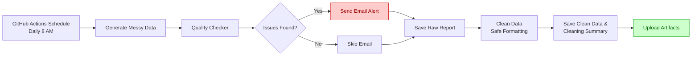
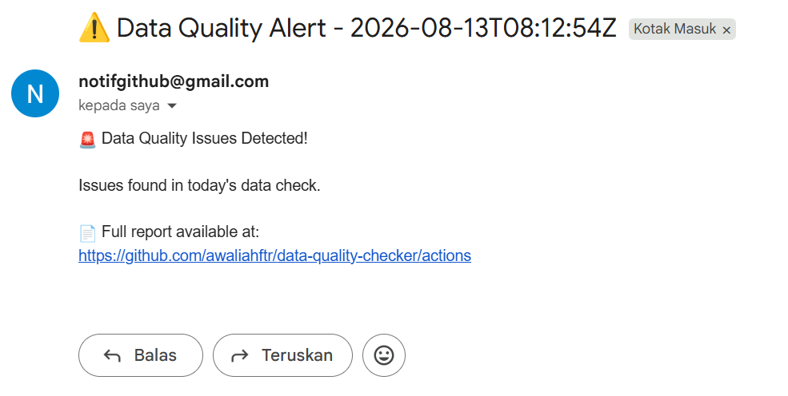
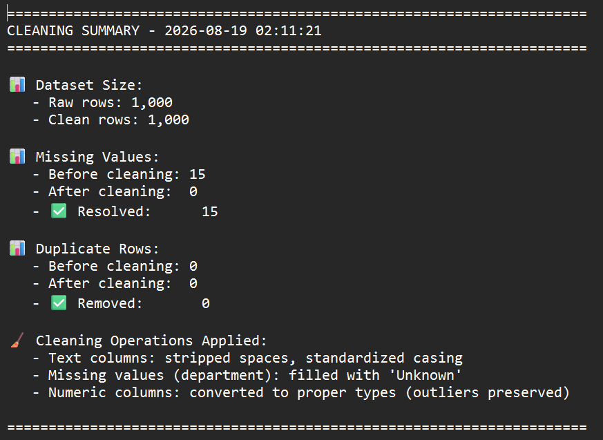
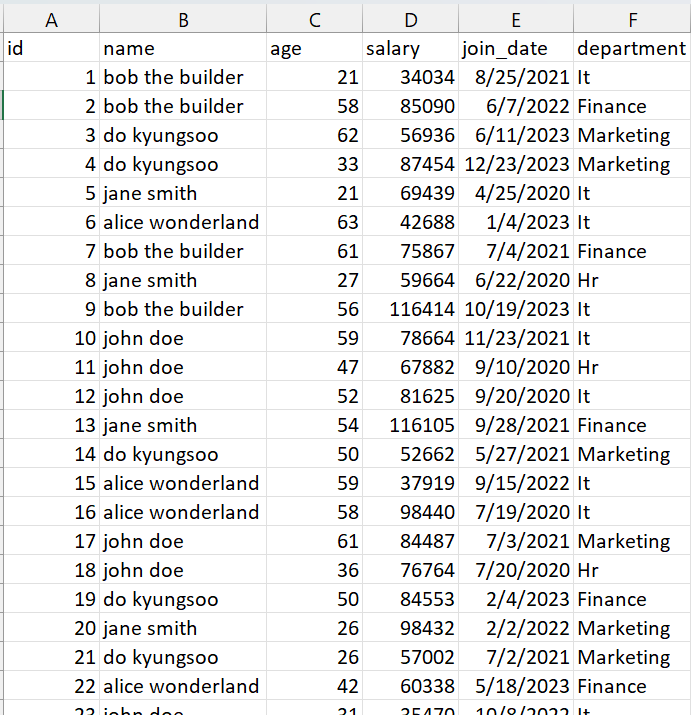

# 🔍 Automated Data Quality Checker


## 📌 Overview
An end-to-end data quality monitoring pipeline that runs **automatically every day** via GitHub Actions. It simulates a real-world data engineering workflow where messy data arrives daily, and we need to ensure it is reliable before any analysis or reporting.

## 🎯 Why This Project?
In the real world, data is never clean. This project solves the problem of **manual data checking** by automating the entire process:

- **Detects** missing values, duplicates, schema drift, outliers, and format inconsistencies.
- **Alerts** the team via email when critical issues are found.
- **Cleans** data safely (standardizing text formats and categorical values).
- **Audits** changes with before/after cleaning summaries for full transparency.

## ⚙️ How It Works (Flowchart)

The pipeline runs daily at 8 AM, generates messy data, runs quality checks, sends email alerts if critical issues are found, then cleans the data and uploads reports as artifacts for full transparency.

## 🛠️ Tech Stack
- **Python** (Pandas, NumPy) – Data processing & cleaning
- **GitHub Actions** – Scheduling (daily runs) & CI/CD
- **SMTP** (via `hilarion5/send-mail`) – Email notifications
- **GitHub Artifacts** – Report storage

## 📂 Repository Structure
```
data-quality-checker/
├── .github/workflows/ # CI/CD & scheduling
├── data/ # Raw & cleaned data (generated daily)
├── reports/ # Data quality & cleaning summary reports
├── src/ # Python scripts
│ ├── data_generator.py
│ └── quality_checker.py
├── requirements.txt
└── README.md
```
## 📸 Pipeline Outputs

### 1. Data Quality Report (Before Cleaning)


### 2. Email Alert


### 3. Cleaning Summary


### 4. Cleaned Data (After Cleaning)


## 🚀 How to Run Locally
# Clone the repo
```
git clone https://github.com/awaliahftr/data-quality-checker.git
cd data-quality-checker
```

# Install dependencies
```
pip install -r requirements.txt
```
# Run manually (optional)
```
python src/data_generator.py
python src/quality_checker.py
```
## 🔐 Setting Up GitHub Secrets (For Email Alerts)

To enable email alerts, add these secrets in your repository settings (`Settings -> Secrets and variables -> Actions`):

| Secret Name | Description | Example Value |
| :--- | :--- | :--- |
| `EMAIL_FROM` | Your Gmail address (sender) | `your-email@gmail.com` |
| `EMAIL_USERNAME` | Your Gmail address (same as above) | `your-email@gmail.com` |
| `EMAIL_TO` | Recipient email address | `team-alerts@company.com` |
| `SMTP_PASSWORD` | Google App Password (16 chars, no spaces) | `abcdefghijklmnop` |

> **Note:** You need to generate a Google App Password. Do not use your regular Gmail password.

## 🔗 Connect with Me
- [LinkedIn](https://linkedin.com/in/awaliahftrr)
- [GitHub](https://github.com/awaliahftr)

---

## 🚀 For Further Development

This project was built as a foundation for a production-ready data quality monitoring system. Here are some of the ideas I'm exploring to take it to the next level:

### ✅ Short-term

| Idea | Description | Why It Matters |
| :--- | :--- | :--- |
| **Connect to a Real Database** | Replace CSV reading with PostgreSQL/MySQL connection using SQLAlchemy. | Moves the project from "simulation" to "production-ready". |
| **Dashboard Visualization** | Build a Streamlit dashboard to visualize quality metrics (missing values, duplicates, status) in real-time. | Makes insights accessible to non-technical stakeholders. |
| **Slack/Telegram Alerts** | Add notifications to Slack or Telegram alongside email alerts. | Faster team response times for critical issues. |
| **Enhanced Validations** | Add business-specific checks (e.g., email format validation, age range validation). | Catches more types of data issues automatically. |

### 🛠️ Industry-Standard Upgrades (Mid-term)

| Idea | Description | Why It Matters |
| :--- | :--- | :--- |
| **Integrate Great Expectations** | Replace custom validation logic with Great Expectations (GX Core)—the industry-standard data quality framework. | Shows you can work with tools used in enterprise data teams. |
| **Data Lineage Tracking** | Add metadata tracking to trace data from source to destination. | Simplifies debugging and audit processes. |
| **Automated Data Profiling** | Generate automatic statistics (min, max, distribution) for each column. | Provides quick insights without manual exploration. |

### 🤖 AI-Powered Future (Long-term)

| Idea | Description | Why It Matters |
| :--- | :--- | :--- |
| **Root Cause Analysis with LLMs** | When an anomaly is detected, send a summary to an LLM (e.g., GPT-4) to analyze the context and suggest possible root causes. | Transforms the system from a "reporter" to an "intelligent assistant" for data teams. |
| **Auto-Healing Pipelines** | Implement logic to automatically fix common data quality issues (e.g., fill missing categorical values with 'Unknown'). | Reduces manual intervention and speeds up data delivery. |
| **Anomaly Prediction** | Use time-series forecasting to predict when data quality issues are likely to occur. | Proactive issue prevention rather than reactive detection. |

---

*This project is a living example of how I approach data quality, starting with a solid foundation and continuously evolving to meet real-world challenges.*
