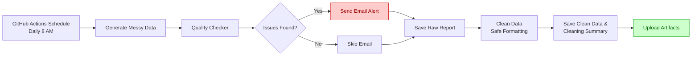

# 🔍 Automated Data Quality Checker


## 📌 Overview
An end-to-end data quality monitoring pipeline that runs **automatically every day** via GitHub Actions. It simulates a real-world data engineering workflow where messy data arrives daily, and we need to ensure it is reliable before any analysis or reporting.

## 🎯 Why This Project?
In the real world, data is never clean. This project solves the problem of **manual data checking** by automating the entire process:

- **Detects** missing values, duplicates, schema drift, outliers, and format inconsistencies.
- **Alerts** the team via email when critical issues are found.
- **Cleans** data safely (standardizing text formats and categorical values).
- **Audits** changes with before/after cleaning summaries for full transparency.

## ⚙️ How It Works (Flowchart)

# How It Works (Flowchart)


## ⚙️ How It Works
1. **Data Generator** creates a daily dataset with intentional errors (missing values, inconsistent formats, outliers).
2. **Quality Checker** scans the raw data and generates a detailed report.
3. **Email Alert** is sent if critical issues are detected (e.g., missing values, schema mismatches).
4. **Data Cleaner** safely standardizes text fields and categorical missing values (numeric outliers are left untouched for business review).
5. **Cleaning Summary** compares raw vs. cleaned data for full transparency.
6. **Artifacts** (reports and cleaned data) are uploaded to GitHub Actions for download.

## 🛠️ Tech Stack
- **Python** (Pandas, NumPy) – Data processing & cleaning
- **GitHub Actions** – Scheduling (daily runs) & CI/CD
- **SMTP** (via `hilarion5/send-mail`) – Email notifications
- **GitHub Artifacts** – Report storage

## 📂 Repository Structure
```
data-quality-checker/
├── .github/workflows/ # CI/CD & scheduling
├── data/ # Raw & cleaned data (generated daily)
├── reports/ # Data quality & cleaning summary reports
├── src/ # Python scripts
│ ├── data_generator.py
│ └── quality_checker.py
├── requirements.txt
└── README.md
```

## 📧 Email Alert Sample
 

## 🚀 How to Run Locally
1. Clone this repository
2. Install dependencies: `pip install -r requirements.txt`
3. Run the data generator: `python src/data_generator.py`
4. Run the quality checker: `python src/quality_checker.py`

## 🔗 Connect with Me
- [LinkedIn](https://linkedin.com/in/awaliahftrr)
- [GitHub](https://github.com/awaliahftr)
